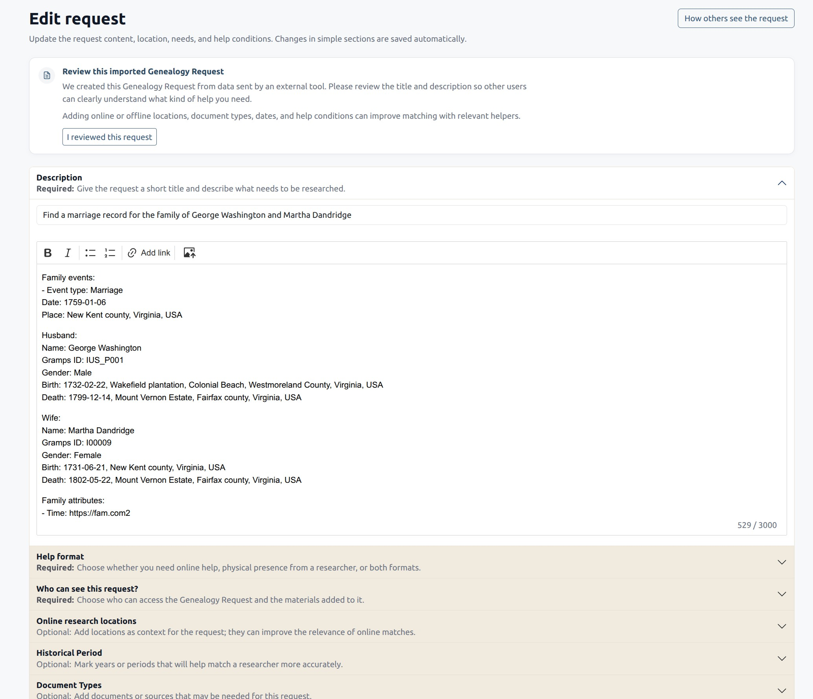
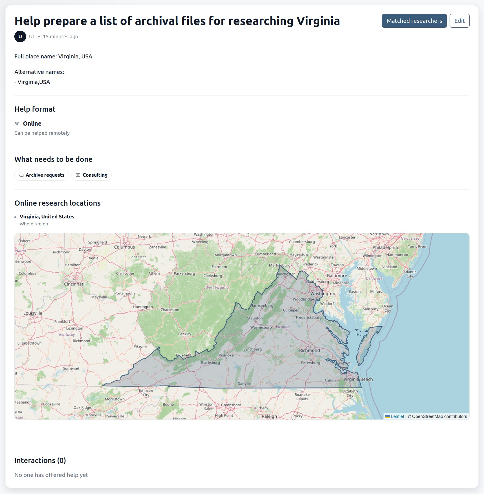
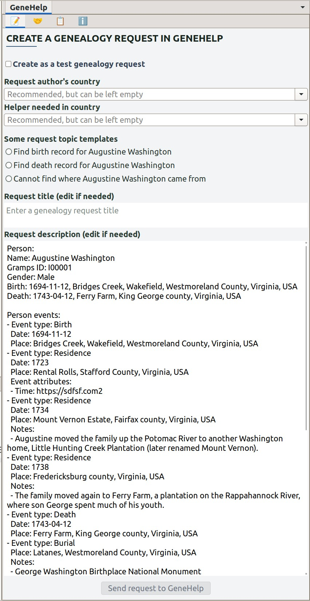
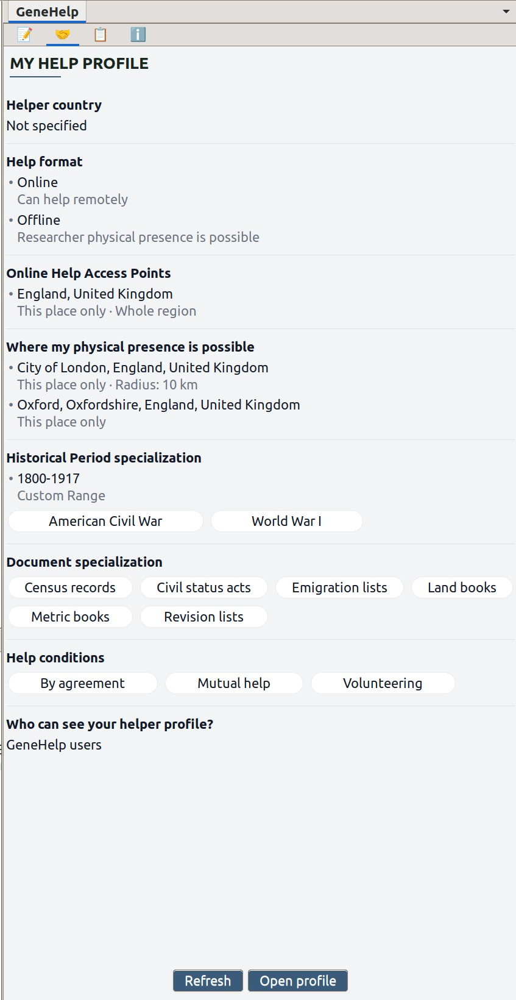
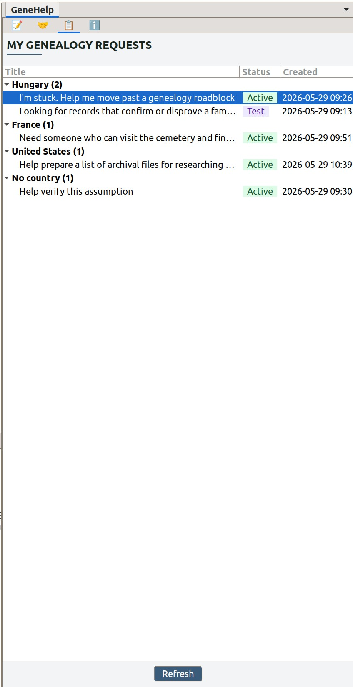
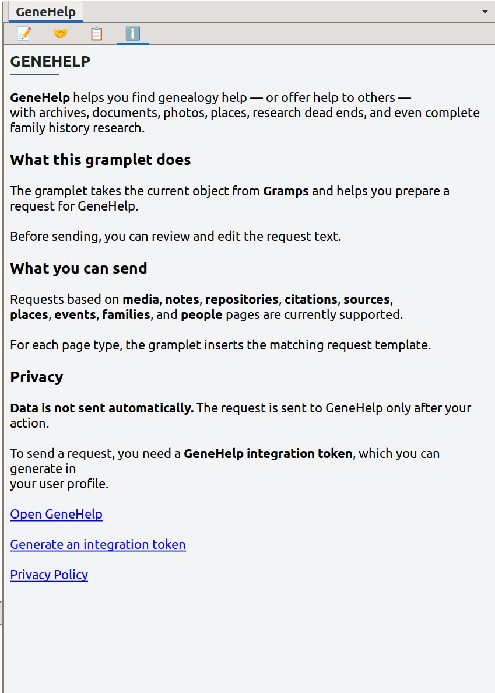

# GeneHelp Gramplet

The GeneHelp Gramplet helps you create genealogy requests on GeneHelp.online
directly from Gramps. You open a person, family, event, place, source, citation, note,
media file, or repository in Gramps, and the gramplet inserts the available data into the
request form.

## Purpose

The gramplet is useful when your Gramps database already contains part of the
information, but you need help from another person: to find a document, verify
a date or place, decipher an inscription, identify a photo, prepare a search in
any archive in the world, find a grave in your own country or anywhere else in the world,
clarify a person’s origin, get past a research dead end, or even find an expert who can
carry out a full cycle of genealogical research for you.

Instead of manually copying data from Gramps to GeneHelp, you can create
a genealogy request or draft with a prepared title, description, and even a media file,
edit it, and submit it. You can finish editing and completing it later on
https://genehelp.online.

## Main workflow

1. Open the required record in Gramps.
2. Go to the GeneHelp tab in the sidebar.
3. Choose whether to create a test request.
4. If needed, select the request author’s country and the country where help is needed.
5. Choose one of the suggested topic options.
6. Review the title and description prepared by the gramplet.
7. Click the button to submit the request to GeneHelp.
8. After creation, open the request on the GeneHelp website and refine it.

## Test request

If you are not sure whether the description will turn out well, you can create a test request.
To do this, enable the **Create as a test genealogy request** option.


_Test request option: enable this checkbox before submitting if you want to preview
the result privately first._

Only you can see a test request. It is not shown to other users, does not take
part in helper matching, and does not create interactions. Later, you can manually
turn it into a regular request in GeneHelp. If you do not do this, it will be
automatically deleted after 7 days.

This mode is useful for checking the result: you can see how Gramps data is transferred
to the website without immediately creating a real request for other users.

## After creating a request

An automatically generated description can be useful, but it will not always sound
the way another person would understand it. That is why, after creating a request,
it is worth opening the editing page in GeneHelp and reviewing the text.

On the website, you can clarify the title, description, online or offline locations,
document types, time period, and help conditions. The more precise the request is,
the easier it will be for other users to understand what kind of help is needed,
and the better future helper matching can be.



_Created request editing page in GeneHelp: review the generated text and complete
the request details on the website._



_Public request page in GeneHelp: the submitted request can be reviewed with its
help format, needed work, research locations, and interactions._


## Gramplet tabs

### Request

The main tab for creating a genealogy request. It shows the form for the active
Gramps record: test mode, countries, topic options, title, description, and the
submit button.

For media files, the button separately indicates that the request will be submitted together
with the media. If the file is unsuitable or cannot be read, the gramplet will warn you
about this and allow you to create a text request without the file.



_Request creation tab in Gramps: topic selection, countries, title, description,
and the submit button._

### My Help Profile

This tab shows your help profile from GeneHelp. It represents how you are ready to help
other researchers online or offline. This is not required, but you can configure it.
Here you can quickly review which help areas are enabled for you on the website:
countries, research types, and so on.

Profile editing is done on the GeneHelp website.



_My Help Profile tab: a read-only preview of your helper profile from GeneHelp._

### My requests

This tab shows all your genealogy requests from GeneHelp. It helps you quickly return
to requests you have already created, open them on the website, or go to editing.

Test requests will also be available in your list.



_My requests tab: your GeneHelp requests grouped by helper country with status badges._


### Info

The information tab briefly explains what GeneHelp is:

GeneHelp helps you find genealogy help — or offer help to others — with
archives, documents, photos, places, research dead ends, and even complete
family history research.



_Info tab: a short description of GeneHelp and links to the website, integration token,
and privacy policy._

## What data can be used

### People

For a person, the gramplet can add the name, Gramps ID, gender, birth, death,
events, partners, attributes, and notes. Typical topics include finding a birth record,
finding a death record, or determining where the person came from.

### Families

For a family, the gramplet can add the husband, wife, children, family events,
attributes, and notes. Typical topics include finding a marriage record or confirming
children in the family.

### Events

For an event, the gramplet can add the type, date, description, place, related people,
attributes, and notes. Typical topics include finding a document about the event or
verifying the date or place.

### Places

For a place, the gramplet can add the full name, alternative names, coordinates,
a Google Maps link, and notes. Typical topics include finding out where to look for
records for a locality or preparing a list of archival files for researching a place.

### Sources

For a source, the gramplet can add the title, author, publication information,
abbreviation, related repositories, attributes, and notes. Typical topics include finding
a local researcher to digitize an archival file or finding someone who can visit
a cemetery and locate a monument.

### Citations

For a citation, the gramplet can add the source title, author, date, volume or page,
attributes, and notes. Typical topics include finding the original document or getting
an online consultation from an expert.

### Repositories

For a repository, the gramplet can add the name, type, web addresses, and notes. This is
useful when you need to find someone who can help with a specific archive,
library, museum, or other institution.

### Media

For a media file, the gramplet can add descriptive data, attributes, and notes, as well as
submit the file itself if it is supported. Typical topics include identifying a photo,
seal, coat of arms, or place in an image.

### Notes

For a note, the gramplet can use its text as the basis for a request. Typical topics include
checking an assumption, getting past a research dead end, or finding documents
for a family legend.

## Settings

To use the gramplet, you need a GeneHelp integration token. You can get it in your
GeneHelp profile on the Integrations tab and paste it into the gramplet settings in
Gramps.

Countries in the form are recommended, but you can leave them empty. If the country is known,
it helps describe the genealogy request more accurately and prepare it better for future
helper matching.

## Privacy and security

The gramplet does not send data on its own. Data is sent to GeneHelp only after
you click the request creation button. You can always change the visibility of your genealogy request
and personal profile, and you can also contact support to request deletion of all your personal data.

The gramplet does not edit records in your Gramps database. It does not create, modify, or
delete people, families, events, sources, places, notes, or media in Gramps.

If you want to check the result first, create a test request.

## Technical checks

Run the baseline check script:

```bash
./scripts/check-code.sh
```

The script runs:

- `python3 -m py_compile`
- smoke import check: `import Genehelp`
- `black --check`
- `ruff check`
- `mypy` for pure logic, parser, API, model, and test modules
- full `pylint`
- `pytest tests`

Run mypy directly when working on parser, API, payload, model, country, request,
or extractor code:

```bash
mypy genehelp/api_client.py genehelp/api_contract.py genehelp/config.py genehelp/countries.py genehelp/diagnostics.py genehelp/gramps_context.py genehelp/help_offer.py genehelp/models.py genehelp/payloads.py genehelp/genealogy_requests.py genehelp/themes.py genehelp/extractors/*.py tests/*.py
```
